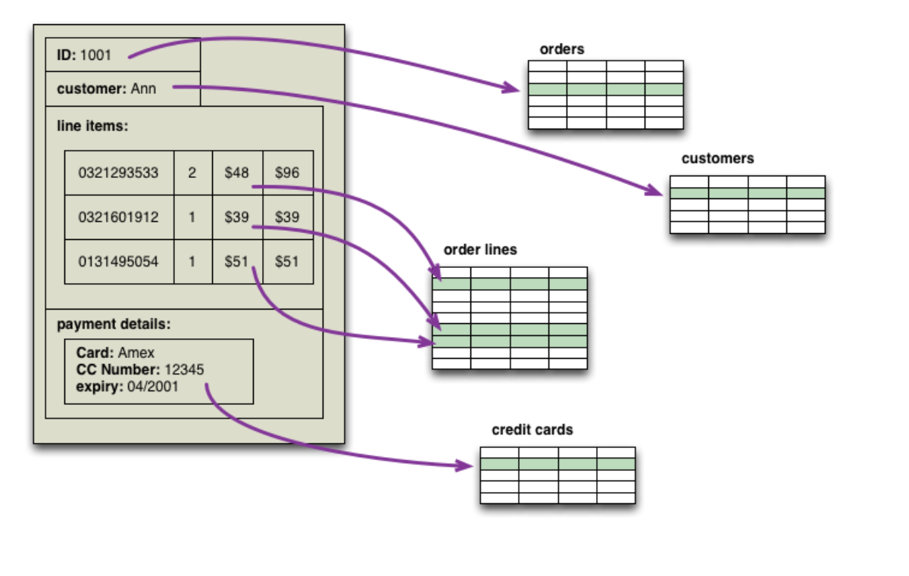

# NoSQL 

## Problema

Dado o conjunto de tabelas abaixo, qual seria o formato de uma query para montar os dados para a seguinte tela abaixo em um modelo de dados relacional ?



Link do post de referência da imagem acima [aqui](https://martinfowler.com/bliki/AggregateOrientedDatabase.html).

### Talves seria algo assim ....

```sql

select * from Orders orders 
  
  inner join Customers customers
  on orders.id_customer = customers.id
  
  inner join Credit_Card card
  on customers.id = card.id_customers
   
  ---- Provavelmente teriamos mais ligações entre a tabelas e mais joins aqui ...

    where <condicao> 

      group by id_customer

```

Com isso conseguimos levantar três passos fundamentais para modelar um sistema com base de dados relacional: 

1. Definir as tabelas e seus relacionamentos;
2. Definir a estratégia de recuperar os dados persistidos;
3. Definir estratégia de conversão do modelo relacional para o seu modelo de domínio.

[Fonte.](https://arleypadua.medium.com/porque-armazenar-agregados-com-nosql-b2a460ffe18a)


> E agora trazendo para um modelo de dados noSQL como seria?


Para responder a pergunta acima precisamos conhecer o tipo de banco de dados noSQL que vamos usar. 

Existem 4 principais tipos no mercado atualmente.


#### Modelo colunas

Apesar de serem parecidos com o modelo relacional, o NoSQL do tipo colunas não trabalha com tabelas na sua estrutura. Aqui, as informações possuem suas colunas próprias, que podem ser agrupadas em uma mesma família — mas esse agrupamento não é um item obrigatório.

A grande vantagem do modelo colunas é proporcionar o gerenciamento de grandes volumes de dados com simplicidade e, principalmente, velocidade. Para aplicações de Big Data, por exemplo, essa característica é fundamental.

#### Modelo grafos

Como o nome esclarece, o modelo grafo tem como característica o armazenamento em nós conectados por arestas — e com propriedades únicas. Isso proporciona mais velocidade em pesquisas complexas, onde é necessária uma baixa latência para recuperar as informações.

Os bancos de dados baseados em grafos têm ganhado popularidade nos últimos anos, mas a sua curva de aprendizado ainda impede que mais empresas o utilizem em nível de produção.

#### Modelo chave valor

O modelo chave-valor é um dos tipos mais populares de NoSQL, justamente pela facilidade de gerenciamento e flexibilidade na operação. Para isso, seu funcionamento é simples: os dados são registrados em uma chave que, por sua vez, guardam algum valor.

Assim, para consultar os dados só é necessário saber qual é a chave também tratada como propriedade para recuperar o valor associado, que pode ter vários formatos.

#### Modelo documento

NoSQL do tipo documento cuja principal característica é a flexibilidade no armazenamento dos dados. Nesse modelo não é necessário ter qualquer estrutura pré-definida, já que essas são estabelecidas conforme a necessidade da aplicação.

Inclusive, o modelo de documento pode contar com agrupamentos de documentos. Ou seja, é possível aninhar informações de formatos diferentes sem qualquer tipo de burocracia ou dificuldade.

Então, é possível trabalhar com documentos únicos, ou mesmo um conjunto de documentos, conforme a aplicação necessitar
 
Principais entidades envolvidas

* Database: ẽ onde ficam as collection e dados;
* Collections: são como tabelas nos bancos de dados relacionais, é nelas que ficam armazenados os dados;
* Documentos: são os dados;

### Conteúdo

Vamos mostrar mais detalhes de forma práticas alguns elementos fundamentais para se modelar e trabalhar com bancos de dados noSQL.

O conteúdo prático será voltado para os bancos:

* [MongoDB](../files/mongo/README.md);
* [Firebase](../files/firebase/README.md);

### Exercicios

[M3S7] 1- Query - Importe a colection anexada e realise uma consulta simples trazendo todos os usuários que possuem email com dominio "gmail.com"

   Mongo 

     * db.exercicios.find({"email": {'$regex':'gmail'}})
     * db.exercicios.find({"email": {'$regex':'gmail'}})

   Firebase 

    * usar o console


[M3S7] 2 - Query - Importe a colection anexada e realise uma consulta simples trazendo todos os usuários que possuem idade acima de 10 anos

   Mongo

   	* db.exercicios.find({"age": {'$gt':"10"}})

   Firebase 

    * usar o console
    

[M3S7] 3 - Query - Importe a colection anexada e realise uma consulta simples trazendo todos os usuários que possuem "Henrique" em seu nome

   Mongo

     * db.exercicios.find({"name": {'$regex':'Henrique'}})
     * db.exercicios.find({"name": {'$regex':'Henrique'}})

   Firebase 

    * usar o console

[M3S7] 4 - Index - No serviço de Firestore DataBase. Crie uma coleção chamada livros com os seguintes campos

		titulo : Clean Architecture
		autor : Robert Cecil Martin

		titulo: Domain-Driven Design
		autor : Eric Evans

		titulo: Working Effectively with Legacy Code
		autor : Michael Feathers

		Todos os campos serão do tipo String

[M3S7] 5 - Index - No serviço de Firestore DataBase. Com a coleção criada no exercicio 4 crie um indice

   Mongo

	   db.exercicios.insertMany([
		  {titulo: "Clean Architecture", autor:"Robert Cecil Martin"},
		  {titulo: "Domain-Driven Design", autor:"Eric Evans"},
		  {titulo: "Working Effectively with Legacy Code", autor:"Michael Feathers"}
	   ])

	   * db.exercicios.createIndex({ certificate_number: 1 })

	 Firebase

	  * No console

	
[M3S7] 6 - Performance - Importe a colection anexada analise e altere sua estrutura de dados para melhorar a performance da coleção.

[Documentação Firebase](https://firebase.google.com/docs/database/web/structure-data)